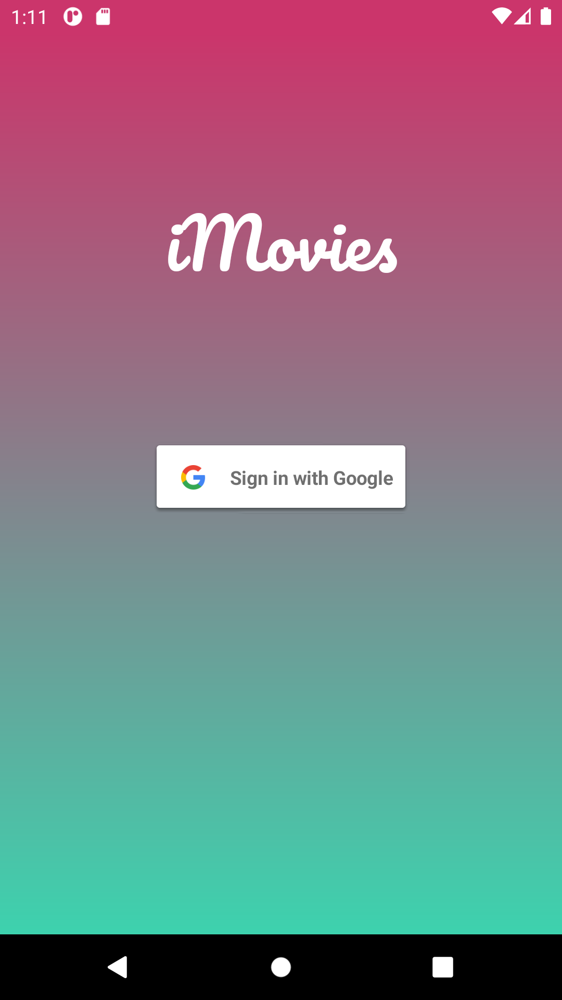

# iMovies

This is an Android app to register series and movies the user is watching.

The user logs in using a Google account. We use [Firebase](https://firebase.google.com/) to manage our project.

#### This was an assignment for Mobile Apps class at University of Passo Fundo in 2018-1.
